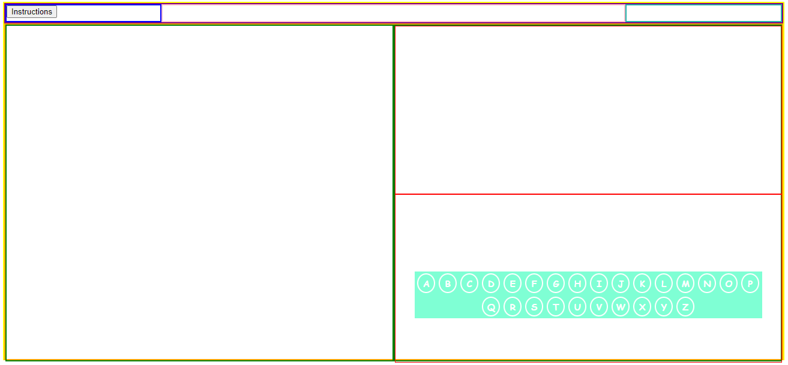
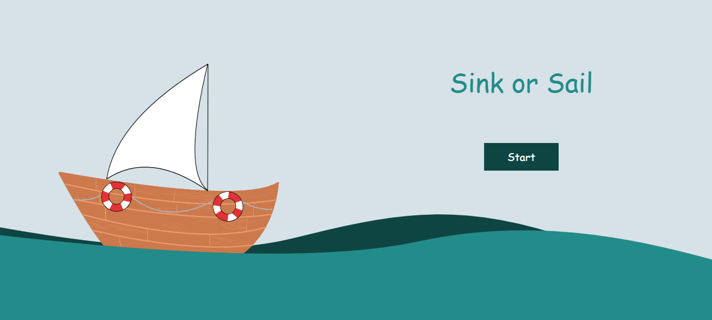
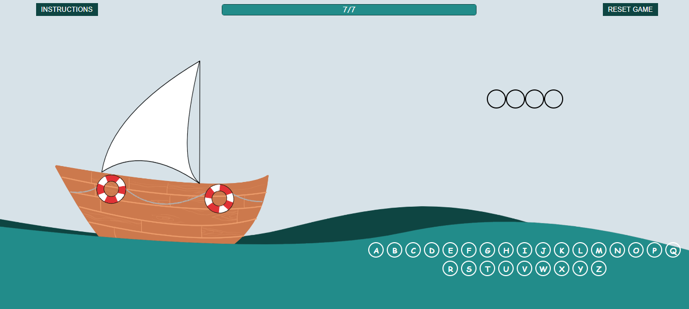

# Sink or Sail Game  

### Description of the app
The Sink or Sail game is similar to the hangman game except you have a ship instead of a man.  
You will have a randomly generated word by the JavaScript & you have to guess it. The number of letters in the word will be displayed on the screen with circles. You can choose a letter by clicking on it, if the word contains the letter chosen it will be added to the empty circles & if not your ship will be damaged. When you guess the word completely there will be a win message displayed & if you guess 7 letters incorrectly the ship will sink and you will have a message displaying the lose message with the correct answer.  
Instructions are provided in the game on the top left corner which can be diplayed at any time during the game.  
Reset button is provided on the top right corner of the game page which can be used to reset the game & generate a new random word at any time during the game. Also, there are reset buttons in the instructions pop-up & the win or lose message pop-up which all work the same.  

### Link to the game  

<a href="https://layla-baqer.github.io/Project1-Sink-or-Sail/">**Sink or Sail Game Link**</a>  

### Approach taken  
* The game was first planned by brainstorming all the requirements & ideas on paper.  
* An outline for all the divs was made using CSS & HTML.  
* Firstly the JavaScript was written with all working functionality, then the CSS was completed with backgrounds & images.  

### Explanations of the technologies used  
* DOM manipulation was used to select elements from the HTML & add new divs, classes & change styles.  
* JavaScript was used to create divs for alphabetic letters & the random word divs using for loops.  
* Functions with event listeners were used to check if the clicked letter is correct or not.  
* If & else conditions were used to display win when the word was guessed correctly or lose message when the maximum number of fault letter guesses was reached.  
* HTML was used to create the basic page organization with title and divs that have classes & ids.  
* CSS was used to arrange all the divs in their planned places, add images, colors, font sizes, font families, borders, etc.  

### Wireframes  
  
* Game Outline:  

  
  
* Start Page:  
  
  
  
* Game Page:  
  
  
  

### Post-project reflection  
Following ideas would be added in future development of the game:  
* Allow selsection for one player or two players in the start page.  
* If two players option is chosen, then allow one player to type a word for the other player to guess.  
* Keep a score for the two players option or a win streak for the one player when a word is guessed correctly.  

### Sources used  

* Modal reference:  
  https://www.w3schools.com/howto/howto_css_modals.asp

* Progress bar reference:  
  https://www.w3schools.com/howto/howto_js_progressbar.asp